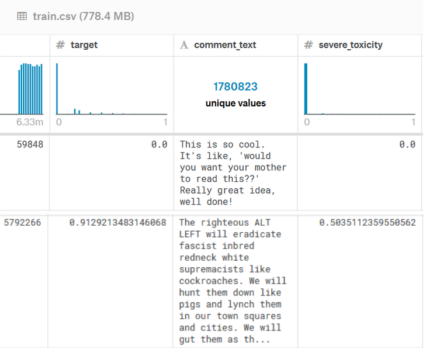

# BERT for toxicity detection
 Kaggle competition: Jigsaw Unintended Bias in Toxicity Classification

## Introduction
This challenge consists on a research initiative founded by Jigsaw and Google (both part of Alphabet) which goal is to identify toxic comments among a databse of social networks comments.

Previous challenges drawbacks: the models incorrectly learned to associate the names of frequently attacked identities with toxicity. Models predicted a high likelihood of toxicity for comments containing those identities (e.g. "gay"), even when those comments were not actually toxic (such as "I am a gay woman").

## Dataset

The dataset consists on 1.780.823 unique text comments where toxic comments represent less than 3% of the data.

 

  

The dataset has been split into a train and validation partitions keeping the same toxicity distribution the original dataset had.
At the same time that we split the dataset we tokenize all the input sentence and store them in a pickle file to avoid reprocessing the dataset at each experiment.

### Developed code:
- Tokenize + store pickle: https://github.com/jorditruji/BERT_kaggle/blob/master/Data_management/prepare_dataset.py
- Dataset split and data utils: https://github.com/jorditruji/BERT_kaggle/blob/master/Data_management/data_helpers.py

## BERT Model:

BERT is designed to pre-train deep bidirectional representations by jointly conditioning on both left and right context in all layers. 
As a result, the pre-trained BERT representations can be fine-tuned with just one additional output layer to create state-of-the- art models for a wide range of tasks, such as question answering and language inference, without substantial task-specific architecture modifications.
In our case, the task is sentence classification between toxic/no toxic (0 or 1), but we can also treat it as a regression problem (how toxic the sentence is, from float 0.0 to float 1.0)

BERT is fully based on self-attention  which allows it to look at other positions in the input sequence for clues that can help lead to a better encoding for a word.

The original implementation of BERT we used for this project can be found at https://github.com/huggingface/pytorch-pretrained-BERT.

### Training

Different strategies has been followed by using as loss MSE between model predictions and float toxicity and also combining it with a sample weighted BCE using the binary ground-truth.

The resulting training script can be found at https://github.com/jorditruji/BERT_kaggle/blob/master/bert_regression.py.

### Results

The model has been trained for 4 epochs using an initial LR of 2e-5, a warmup of 0.1 and Adam algorithm as optimizer:

| Epoch        | MSE           | Accuracy  |
| ------------- |:-------------:| -----:|
| 1      | 1.33404746 | 0.95472092|
| 2       | 1.17825316      |    0.95902277 |
| 3 |1.00735244 |    0.96428235 |
| 4 | 0.87871132      |     0.96826997 |

The final model was tested agains our validation partition with an accuracy of  0.96269972 and a MSE of 0.92.

* Note that the MSE is computed in a toxicity scale between 0 and 10.

## Next steps

Make more experiments and take part in the competition
